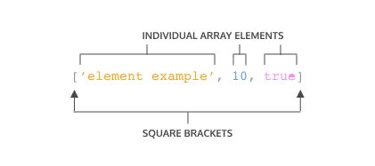
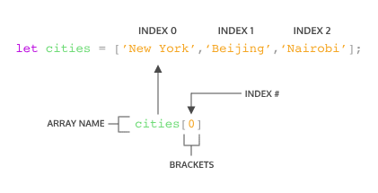

Arrays
Organizing and storing data is a foundational concept of programming.

One way we organize data in real life is by making lists. Let’s make one here:

New Year's Resolutions:

1. Keep a journal 
2. Take a falconry class
3. Learn to juggle
Let’s now write this list in JavaScript, as an array:

let newYearsResolutions = ['Keep a journal', 'Take a falconry class', 'Learn to juggle'];

Copy to Clipboard

Arrays
Preview: Docs Loading link description
 are JavaScript’s way of making lists. Arrays can store any 
data types
Preview: Docs Loading link description
 (including 
strings
Preview: Docs Loading link description
, numbers, and booleans). Like lists, arrays are ordered, meaning each item has a numbered position.

Here’s an array of the concepts we’ll cover:

let concepts = ['creating arrays', 'array structures', 'array manipulation'];

Copy to Clipboard

By the end of this lesson, you’ll have another tool under your belt that helps you manage chunks of data!

---------------------------------------------------------------

Create an Array
One way we can create an array is to use an array literal. An array literal creates an array by wrapping items in square brackets []. Remember from the previous exercise, 
arrays
Preview: Docs Loading link description
 can store any data type — we can have an array that holds all the same 
data types
Preview: Docs Data types are used to classify eight fundamental values used for programming in JavaScript, including primitive and object types.
 or an array that holds different data types.

 

Diagram outlining an array literal that has 3 separate elements, a comma separates each element (a string, a number, and a boolean), and the elements are wrapped with square brackets
Let’s take a closer look at the syntax in the array example:

The array is represented by the square brackets [] and the content inside.
Each content item inside an array is called an element.
There are three different elements inside the array.
Each element inside the array is a different data type.
We can also save an array to a variable. You may have noticed we did this in the previous exercise:

let newYearsResolutions = ['Keep a journal', 'Take a falconry class', 'Learn to juggle'];

Copy to Clipboard

Let’s practice by making an array of our own.

-----------------------------------------------------

Accessing Elements
Each element in an array has a numbered position known as its index. We can access individual items using their index, which is similar to referencing an item in a list based on the item’s position.

Arrays in JavaScript are zero-indexed, meaning the positions start counting from 0 rather than 1. Therefore, the first item in an array will be at position 0. Let’s see how we could access an element in an array:

Diagram outlining how to access the property of an array using the index of the element
In the code snippet above:

cities is an array that has three elements.
We’re using bracket notation, [], with the index after the name of the array to access the element.
cities[0] will access the element at index 0 in the array cities. We can think of cities[0] as accessing the space in memory that holds the string 'New York'.
We can also access individual characters in a string using bracket notation and the index. For instance, we can write:

const hello = 'Hello World';
console.log(hello[6]);
// Output: W

Copy to Clipboard

The console will display W since it is the character that is at index 6.

----------------------------------------------------------------------

Update Elements
In the previous exercise, we learned how to access elements inside an array or a string by using an index. With access to an element in an array, we can also update its value.

let seasons = ['Winter', 'Spring', 'Summer', 'Fall'];

seasons[3] = 'Autumn';
console.log(seasons); 
//Output: ['Winter', 'Spring', 'Summer', 'Autumn']

Copy to Clipboard

In the example above, the seasons array contained the names of the four seasons.

However, we decided that we preferred to say 'Autumn' instead of 'Fall'.

This line — seasons[3] = 'Autumn'; — tells our program to change the item at index 3 of the seasons array to be 'Autumn' instead of what is already there.

------------------------------------------------------------------

Arrays with let and const
Recall that we can declare 
variables
Preview: Docs Loading link description
 with both the let and const keywords. Variables declared with let can be reassigned.

Variables declared with the const keyword cannot be reassigned. However, elements in an array declared with const remain mutable. This means that we can change the contents of a const array but cannot reassign a new array or a different value.

The instructions that follow will illustrate this concept more clearly. While completing the steps, pay close attention to the similarities and differences between the condiments and utensils 
arrays
Preview: Docs Loading link description.

-------------------------------------------------------------------------

The .length property
One of an array’s built-in properties is length, and it returns the number of items in the array. We access the 
.length
Preview: Docs Loading link description
 property just like we do with strings. Check the example below:

const newYearsResolutions = ['Keep a journal', 'Take a falconry class'];

console.log(newYearsResolutions.length);
// Output: 2

Copy to Clipboard

In the example above, we log newYearsResolutions.length to the console using the following steps:

We use dot notation, chaining a period with the property name to the array, to access the length property of the newYearsResolutions array.
Then, we log the length of newYearsResolution to the console.
Since newYearsResolution has two elements, 2 would be logged to the console.
When we want to know the number of elements in an array, we can access the .length property.

-----------------------------------------------------------------------

The .push() Method
Let’s learn about some built-in JavaScript 
methods
Preview: Docs Loading link description
 that make working with arrays easier. These methods are specifically called on arrays to make common tasks, like adding and removing elements, more straightforward.

One method, 
.push(),
Preview: Docs Loading link description
 allows us to add items to the end of an array. Here is an example of how this is used:

const itemTracker = ['item 0', 'item 1', 'item 2'];

itemTracker.push('item 3', 'item 4');

console.log(itemTracker); 
// Output: ['item 0', 'item 1', 'item 2', 'item 3', 'item 4'];

Copy to Clipboard

So, how does .push() work?

We access the push method by using dot notation, connecting push to itemTracker with a period.
Then, we call it like a function. That’s because .push() is a function that JavaScript allows us to use right on an array.
.push() can take a single argument or multiple arguments separated by commas. In this case, we’re adding two elements: 'item 3' and 'item 4' to itemTracker.
Notice that .push() changes, or mutates, itemTracker. .push() is sometimes also referred to as a destructive array method since it changes the initial array.
When looking for a method that will mutate an array by adding one or more elements to it, .push() is the correct choice!

---------------------------------------------------------------------------

The .pop() Method
Another array method, 
.pop()
Preview: Docs Loading link description
, removes the last item of an array.

const newItemTracker = ['item 0', 'item 1', 'item 2'];

const removed = newItemTracker.pop();

console.log(newItemTracker); 
// Output: [ 'item 0', 'item 1' ]
console.log(removed);
// Output: item 2

Copy to Clipboard

In the example above, calling .pop() on the newItemTracker array removed item 2 from the end.
.pop() does not take any arguments — it simply removes the last element of newItemTracker.
.pop() returns the value of the last element. In the example, we store the returned value in a variable removed to be used later.
.pop() is a method that mutates the initial array.
When an array needs to be mutated by removing the last element, use .pop().

---------------------------------------------------------------------------

More Array Methods
There are many more array 
methods
Preview: (link: https://www.codecademy.com/resources/docs/javascript/arrays) Docs Methods are object properties that contain functions.
 than just 
.push()
Preview: Docs Loading link description
 and 
.pop()
Preview: Docs Loading link description
. To read more about these array methods, visit the 
Docs entry for JavaScript Arrays
Preview: Docs Loading link description
.

.pop() and .push() mutate the array on which they’re called. However, there are times that we don’t want to mutate the original array and we can use non-mutating array methods. Be sure to check the Docs to understand the behavior of the method before using it.

Some other array methods that are available to JavaScript developers include: 
.join()
Preview: Docs Loading link description
, .slice(), 
.splice()
Preview: Docs Loading link description
, 
.shift()
Preview: Docs Loading link description
, 
.unshift()
Preview: Docs Loading link description
, and .concat(). Using these built-in methods makes it easier to do some common tasks when working with arrays.

In this exercise, we will explore some methods that we have not learned yet. We will use these methods to edit a grocery list. As you complete the steps, you can consult the 
Codecademy Docs
Preview: Docs Loading link description
 to learn what each method does!

 -------------------------------------------------------------------------------------------

Arrays and Functions
Throughout this lesson, we went over arrays being mutable, or changeable. Well what happens if we try to change an array inside a function? Does the array keep the change after the function call or is it scoped to inside the function?

Take a look at the following example where we call 
.push()
Preview: Docs Loading link description
 on an array inside a function. Recall, the .push() method mutates, or changes, an array:

const flowers = ['peony', 'daffodil', 'marigold'];

function addFlower(arr) {
  arr.push('lily');
}

addFlower(flowers);

console.log(flowers); // Output: ['peony', 'daffodil', 'marigold', 'lily']

Copy to Clipboard

Let’s go over what happened in this example:

The flowers array starts with 3 elements.
The function addFlower() has a parameter of arr and uses .push() to add a 'lily' element into arr.
We call addFlower() with an argument of flowers, which will execute the code inside addFlower.
We check the value of flowers and it now includes the 'lily' element! The array was mutated!
So when we pass an array into a function, if the array is mutated inside the function, that change will be maintained outside the function as well. This concept is also sometimes called pass-by-reference, since what we’re actually passing to the function is a reference to where the variable is stored in memory and changing the data there.

bsp

const concept = ['arrays', 'can', 'be', 'mutated'];

function changeArr(arr){
  arr[3] = 'MUTATED';
}

changeArr(concept);

console.log(concept);

function removeElement(newArr){
  newArr.pop();
};

removeElement(concept);

console.log(concept);

---------------------------------------------------------------------------

Nested Arrays
Earlier we mentioned that 
arrays
Preview: Docs Arrays are lists of ordered, stored data that can be of any data type.
 can store other arrays. When an array contains another array it is known as a nested array. Examine the following example:

const nestedArr = [[1], [2, 3]];

Copy to Clipboard

To access the nested arrays, we can use bracket notation with the index value, just like we did to access any other element:

const nestedArr = [[1], [2, 3]];

console.log(nestedArr[1]); // Output: [2, 3]

Copy to Clipboard

Notice that nestedArr[1] will grab the element in index 1, which is the array [2, 3]. Then, we can access the elements within the nested array by chaining, or adding on, more bracket notation with index values.

const nestedArr = [[1], [2, 3]];

console.log(nestedArr[1]); // Output: [2, 3]
console.log(nestedArr[1][0]); // Output: 2

Copy to Clipboard

In the second console.log() statement, we have two bracket notations chained to nestedArr. We know that nestedArr[1] is the array [2, 3]. Then, to grab the first element from that array, we use nestedArr[1][0] and we get the value of 2.

bsp

const numberClusters = [[1, 2], [3, 4], [5, 6]];

const target = numberClusters[2][1];

console.log(target);

------------------------------------------------------------------

Review Arrays
Nice work! In this lesson, we learned these concepts regarding arrays:

Arrays are lists that store data in JavaScript.
Arrays are created with brackets [].
Each item within an array is located at a numbered position, or index, starting at 0.
We can access one item in an array using its index, with syntax like: myArray[0].
We can also change an item in an array using its index, with syntax like myArray[0] = 'new string';
Arrays have a length property, which allows you to see how many items are in an array.
Arrays have their own 
methods
Preview: Docs Loading link description
, including 
.push()
Preview: Docs Loading link description
 and 
.pop()
Preview: Docs Loading link description
, which add and remove items from an array, respectively.
Arrays have many methods that perform different tasks, such as .slice() and 
.shift()
Preview: Docs Loading link description
, you can find documentation at the Mozilla Developer Network website.
Some built-in methods are mutating, meaning the method will change the array, while others are not mutating. You can always check the documentation.
Variables
Preview: Docs Loading link description
 that contain arrays can be declared with let or const. Even when declared with const, arrays are still mutable. However, a variable declared with const cannot be reassigned.
Arrays mutated within a function will keep that change even outside the function.
Arrays can be nested inside other arrays.
To access elements in nested arrays, chain indices using bracket notation.
Learning how to work with and manipulate arrays will help you work with chunks of data!