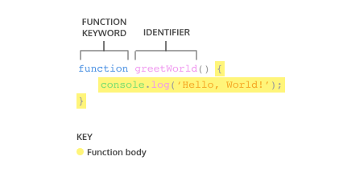
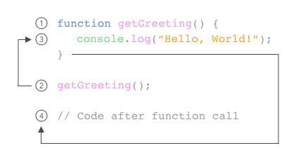

Was sind Funktionen?
Wenn man zum ersten Mal lernt, wie man die Fläche eines Rechtecks berechnet, gibt es eine Abfolge von Schritten, um das richtige Ergebnis zu erhalten:

Messe die Breite des Rechtecks.

Messe die Höhe des Rechtecks.

Multipliziere die Breite und die Höhe des Rechtecks.

Mit etwas Übung kannst du die Fläche eines Rechtecks berechnen, ohne jedes Mal diese drei Schritte erklärt zu bekommen.

Wir können die Fläche eines Rechtecks mit folgendem Code berechnen:

const width = 10;
const height = 6;
const area =  width * height;
console.log(area); // Output: 60

Stell dir vor, du wirst gebeten, die Fläche von drei verschiedenen Rechtecken zu berechnen:

// Area of the first rectangle
const width1 = 10;
const height1 = 6;
const area1 =  width1 * height1;

// Area of the second rectangle
const width2 = 4;
const height2 = 9;
const area2 =  width2 * height2;

// Area of the third rectangle
const width3 = 10;
const height3 = 10;
const area3 =  width3 * height3;

In der Programmierung verwenden wir oft Code, um eine bestimmte Aufgabe mehrfach auszuführen. Anstatt denselben Code immer wieder neu zu schreiben, können wir einen Codeblock zusammenfassen und mit einer Aufgabe verknüpfen. Diesen Codeblock können wir dann immer wieder verwenden, wenn wir die Aufgabe erneut ausführen müssen.

Das erreichen wir, indem wir eine Funktion erstellen. Eine Funktion ist ein wiederverwendbarer Codeblock, der eine Abfolge von Anweisungen bündelt, um eine bestimmte Aufgabe auszuführen.

In dieser Lektion lernst du, wie man Funktionen erstellt und verwendet und wie sie dabei helfen können, klareren und prägnanteren Code zu schreiben.

------------------------------------------------------------------------

Funktionsdeklarationen
In JavaScript gibt es viele Möglichkeiten, eine Funktion zu erstellen. Eine Möglichkeit, eine Funktion zu erstellen, ist die Verwendung einer Funktionsdeklaration. So wie eine Variablendeklaration einen Wert an einen Variablennamen bindet, bindet eine Funktionsdeklaration eine Funktion an einen Namen bzw. einen Bezeichner. Schau dir die Struktur einer Funktionsdeklaration unten an:

Diagramm, das die Syntax einer Funktionsdeklaration zeigt

Eine Funktionsdeklaration besteht aus:

Dem Schlüsselwort function.

Dem Namen der Funktion, also dem Bezeichner, gefolgt von Klammern ().

Dem Funktionskörper, also dem Block von Anweisungen (Statements), die eine bestimmte Aufgabe ausführen, eingeschlossen in geschweifte Klammern { }.

Eine Funktionsdeklaration ist eine Funktion, die an einen Bezeichner oder Namen gebunden ist. Im nächsten Übungsteil werden wir durchgehen, wie der Code im Funktionskörper ausgeführt wird.

Wir sollten auch das Hoisting in JavaScript beachten, eine Eigenschaft, die den Zugriff auf Funktionsdeklarationen ermöglicht, bevor sie im Code definiert werden.

Schau dir ein Beispiel für Hoisting an:

Eine Funktionsdeklaration besteht aus:

Dem Schlüsselwort function.

Dem Namen der Funktion, also ihrem Bezeichner, gefolgt von Klammern ().

Dem Funktionskörper, also dem Block von Anweisungen (Statements), die eine bestimmte Aufgabe ausführen, eingeschlossen in geschweifte Klammern { }.

Eine Funktionsdeklaration ist eine Funktion, die an einen Bezeichner oder Namen gebunden ist. Im nächsten Übungsteil werden wir durchgehen, wie man den Code im Funktionskörper ausführt.

Wir sollten auch das Hoisting in JavaScript beachten, eine Eigenschaft, die den Zugriff auf Funktionsdeklarationen ermöglicht, bevor sie im Code definiert werden.

Schau dir ein Beispiel für Hoisting an:

greetWorld(); // Output: Hello, World!

function greetWorld() {
  console.log('Hello, World!');
}

Beachte, wie Hoisting es ermöglicht hat, greetWorld() aufzurufen, bevor die Funktion greetWorld() überhaupt definiert wurde! Da Hoisting jedoch nicht als gute Praxis gilt, möchten wir dich nur auf diese Funktionalität hinweisen.

Um mehr über Hoisting zu erfahren, schaue dir die MDN-Dokumentation zu Hoisting an.
https://developer.mozilla.org/en-US/docs/Glossary/Hoisting

Beispiel:

function getReminder() {
  console.log('Water the plants.')
}

function greetInSpanish() {
  console.log('Buenas tardes')
}

----------------------------------------------------------------------------------------------------

Eine Funktion aufrufen
Wie wir in den vorherigen Übungen gesehen haben, bindet eine Funktionsdeklaration eine Funktion an einen Bezeichner.

Eine Funktionsdeklaration fordert jedoch nicht dazu auf, den Code im Funktionskörper auszuführen, sie erklärt nur die Existenz der Funktion. Der Code im Funktionskörper wird erst ausgeführt, wenn die Funktion aufgerufen wird.

Um eine Funktion aufzurufen, gib den Funktionsnamen gefolgt von Klammern () ein.

Dieser Funktionsaufruf führt den Funktionskörper aus, also alle Anweisungen (Statements) zwischen den geschweiften Klammern in der Funktionsdeklaration.

Wir können dieselbe Funktion so oft aufrufen, wie es nötig ist.

Lass uns üben, Funktionen in unserem Code aufzurufen.

Beispiel:

function sayThanks() {
  console.log('Thank you for your purchase! We appreciate your business')
}

sayThanks()
sayThanks()
sayThanks()

output:

Thank you for your purchase! We appreciate your business
Thank you for your purchase! We appreciate your business
Thank you for your purchase! We appreciate your business

--------------------------------------------------------------------------------------------------
Parameter und Argumente
Bisher führen die von uns erstellten Funktionen eine Aufgabe ohne Eingaben aus. Manche Funktionen können jedoch Eingaben entgegennehmen und diese verwenden, um eine Aufgabe auszuführen.

Beim Deklarieren einer Funktion können wir Parameter angeben. Parameter erlauben es Funktionen, Eingaben zu akzeptieren und mit diesen Eingaben eine Aufgabe zu erledigen. Wir verwenden Parameter als Platzhalter für Informationen, die der Funktion beim Aufruf übergeben werden.

Schauen wir uns an, wie man Parameter in einer Funktionsdeklaration angibt:

Bild function parameters!!!!!!!!!!

Im obigen Diagramm berechnet calculateArea() die Fläche eines Rechtecks basierend auf zwei Eingaben, width und height. Die Parameter werden in den Klammern als width und height angegeben und verhalten sich im Funktionskörper wie gewöhnliche Variablen. width und height dienen als Platzhalter für Werte, die miteinander multipliziert werden.

Beim Aufrufen einer Funktion mit Parametern geben wir die Werte in den Klammern hinter dem Funktionsnamen an. Die Werte, die beim Funktionsaufruf übergeben werden, nennt man Argumente. Argumente können als Werte oder Variablen an die Funktion übergeben werden.

BILD by_value!!!!

Im obigen Funktionsaufruf wird die Zahl 10 als width und die Zahl 6 als height übergeben. Beachte, dass die Reihenfolge, in der die Argumente übergeben und zugewiesen werden, der Reihenfolge entspricht, in der die Parameter deklariert sind.

BILD by_variable!!!!!!!!!!!!

Die Variablen rectWidth und rectHeight werden mit den Werten für die Breite und Höhe eines Rechtecks initialisiert, bevor sie im Funktionsaufruf verwendet werden.

Durch die Verwendung von Parametern kann calculateArea() wiederverwendet werden, um die Fläche jedes beliebigen Rechtecks zu berechnen! Funktionen sind ein mächtiges Werkzeug in der Programmierung, also lass uns üben, Funktionen mit Parametern zu erstellen und aufzurufen.

Beispiel:

function sayThanks(name) {
  console.log('Thank you for your purchase, '+ name + '! We appreciate your business.');
}

sayThanks('Cole');

---------------------------------------------------------------------------------------------------------------------

Standardparameter
Eine der Funktionen, die in ES6 hinzugefügt wurden, ist die Möglichkeit, Standardparameter zu verwenden. Standardparameter erlauben es, Parametern einen voreingestellten Wert zuzuweisen, falls kein Argument an die Funktion übergeben wird oder wenn das Argument beim Aufruf undefined ist.

Sieh dir den folgenden Codeausschnitt an, der einen Standardparameter verwendet:

function greeting (name = 'stranger') {
  console.log(`Hello, ${name}!`)
}

greeting('Nick') // Output: Hello, Nick!
greeting() // Output: Hello, stranger!

Beispiel:

function makeShoppingList(item1 = 'milk', item2 = 'bread', item3 = 'eggs'){
  console.log(`Remember to buy ${item1}`);
  console.log(`Remember to buy ${item2}`);
  console.log(`Remember to buy ${item3}`);
}

makeShoppingList()

output:
Remember to buy milk
Remember to buy bread
Remember to buy eggs

------------------------------------------------------------------------------------------------

Rückgabewert (Return)
Wenn eine Funktion aufgerufen wird, führt der Computer den Code der Funktion aus und bewertet das Ergebnis. Standardmäßig ist der Rückgabewert undefined.

function rectangleArea(width, height) {
  let area = width * height;
}
console.log(rectangleArea(5, 7)) // Prints undefined

Im Codebeispiel haben wir eine Funktion definiert, die die Fläche anhand der Parameter width und height berechnet. Dann wurde rectangleArea() mit den Argumenten 5 und 7 aufgerufen. Als wir jedoch das Ergebnis ausgeben wollten, bekamen wir undefined. Haben wir die Funktion falsch geschrieben? Nein! Tatsächlich hat die Funktion korrekt gearbeitet und der Computer hat die Fläche als 35 berechnet, aber wir haben das Ergebnis nicht gespeichert. Wie können wir das also tun? Mit dem Schlüsselwort return!

BILD function return!!!!!!!!!!!!

Um Informationen aus einem Funktionsaufruf zurückzugeben, verwenden wir eine return-Anweisung. Um eine return-Anweisung zu erstellen, verwenden wir das Schlüsselwort return, gefolgt von dem Wert, den wir zurückgeben möchten. Wie oben gesehen, wird undefined zurückgegeben, wenn kein Wert angegeben wird.

Wenn eine return-Anweisung im Funktionskörper verwendet wird, wird die Ausführung der Funktion sofort beendet und der nachfolgende Code wird nicht mehr ausgeführt. Schau dir das folgende Beispiel an:

function rectangleArea(width, height) {
  if (width < 0 || height < 0) {
    return 'You need positive integers to calculate area!';
  }
  return width * height;
}

Wenn ein Argument für width oder height kleiner als 0 ist, gibt rectangleArea() den Wert 'You need positive integers to calculate area!' zurück. Die zweite return-Anweisung — width * height — wird in diesem Fall nicht ausgeführt.

Das Schlüsselwort return ist mächtig, weil es Funktionen ermöglicht, eine Ausgabe zu erzeugen. Diese Ausgabe können wir dann in einer Variable speichern, um sie später zu verwenden.

Beispiel:

function monitorCount(rows, columns) {
  return rows * columns;
}

const numOfMonitors = monitorCount(5, 4)

console.log(numOfMonitors)

--------------------------------------------------------------------------------------------------

Hilfsfunktionen
Wir können den Rückgabewert einer Funktion auch innerhalb einer anderen Funktion verwenden. Solche Funktionen, die innerhalb einer anderen Funktion aufgerufen werden, nennt man oft Hilfsfunktionen. Da jede Funktion eine bestimmte Aufgabe übernimmt, wird unser Code dadurch leichter lesbar und bei Bedarf besser debugbar.

Wenn wir zum Beispiel eine Funktion definieren wollten, die die Temperatur von Celsius in Fahrenheit umrechnet, könnten wir zwei Funktionen wie folgt schreiben:

function multiplyByNineFifths(number) {
  return number * (9/5);
};

function getFahrenheit(celsius) {
  return multiplyByNineFifths(celsius) + 32;
};

getFahrenheit(15); // Returns 59

Im obigen Beispiel:

getFahrenheit() wird mit dem Argument 15 aufgerufen.

Der Codeblock innerhalb von getFahrenheit() ruft multiplyByNineFifths() auf und übergibt 15 als Argument.

multiplyByNineFifths() nimmt das Argument 15 für den Parameter number entgegen.

Der Codeblock innerhalb der Funktion multiplyByNineFifths() multipliziert 15 mit (9/5), was 27 ergibt.

27 wird an den Funktionsaufruf in getFahrenheit() zurückgegeben.

getFahrenheit() führt seine Ausführung fort. Es addiert 32 zu 27, was 59 ergibt.

Schließlich wird 59 an den Funktionsaufruf getFahrenheit(15) zurückgegeben.

Wir können Funktionen verwenden, um kleine Logik- oder Aufgabenabschnitte zu trennen und sie bei Bedarf zu nutzen. Das Schreiben von Hilfsfunktionen kann helfen, große und komplexe Aufgaben in kleinere, besser handhabbare Aufgaben aufzuteilen.

Beispiel:

function monitorCount(rows, columns) {
  return rows * columns;
}

function costOfMonitors(rows, columns) {
  return monitorCount(rows, columns) * 200
}

const totalCost = costOfMonitors(5, 4)

console.log(totalCost)

output:
4000

------------------------------------------------------------------------------------------------------------------------

Funktionsausdrücke
Eine andere Möglichkeit, eine Funktion zu definieren, ist die Verwendung eines Funktionsausdrucks. Um eine Funktion innerhalb eines Ausdrucks zu definieren, können wir das Schlüsselwort function verwenden. Bei einem Funktionsausdruck wird der Funktionsname normalerweise weggelassen. Eine Funktion ohne Namen nennt man anonyme Funktion. Ein Funktionsausdruck wird oft in einer Variablen gespeichert, um später darauf zugreifen zu können.

Betrachte den folgenden Funktionsausdruck:

BILD expression !!!!!!!!!!!!!!!!!!

So deklarierst du einen Funktionsausdruck:

Deklariere eine Variable, deren Name als Bezeichner (Name) der Funktion dient. Seit der Einführung von ES6 ist es gängige Praxis, dafür das Schlüsselwort const zu verwenden.

Weise dieser Variablen als Wert eine anonyme Funktion zu. Diese wird mit dem Schlüsselwort function erstellt, gefolgt von runden Klammern mit möglichen Parametern und anschließend geschweiften Klammern, die den Funktionskörper enthalten.

Um einen Funktionsausdruck aufzurufen, schreibst du den Namen der Variable, in der die Funktion gespeichert ist, gefolgt von Klammern, in denen ggf. Argumente übergeben werden.

variableName(argument1, argument2)

Im Gegensatz zu Funktionsdeklarationen werden Funktionsausdrücke nicht gehoben (not hoisted), das heißt, sie können nicht aufgerufen werden, bevor sie definiert wurden.

Lass uns nun eine neue Funktion mithilfe eines Funktionsausdrucks definieren.

Beispiel:

const plantNeedsWater = function(day) {
  if(day === 'Wednesday') {
    return true;
  } else {
    return false;
  }
}

plantNeedsWater('Tuesday')

console.log(plantNeedsWater('Tuesday'));

output:
false

---------------------------------------------------------------------

Arrow-Funktionen
Mit ES6 wurde die Arrow Function-Syntax eingeführt – eine kürzere Möglichkeit, Funktionen zu schreiben, indem man die spezielle „Fat Arrow“-Schreibweise () => verwendet.

Arrow-Funktionen ersparen uns das wiederholte Ausschreiben des Schlüsselworts function, wenn wir eine Funktion erstellen. Stattdessen schreiben wir zuerst die Parameter in Klammern ( ) und fügen dann einen Pfeil => hinzu, der auf den Funktionskörper zeigt, der in geschweifte Klammern { } eingeschlossen ist, wie hier:

const rectangleArea = (width, height) => {
  let area = width * height;
  return area;
};

Es ist wichtig, mit den verschiedenen Möglichkeiten vertraut zu sein, Funktionen zu schreiben, da wir beim Lesen von anderem JavaScript-Code wahrscheinlich auf jede dieser Varianten stoßen werden.

Beispiel:

const plantNeedsWater = function(day) {
  if (day === 'Wednesday') {
    return true;
  } else {
    return false;
  }
};

zu

const plantNeedsWater = (day) => {
  if (day === 'Wednesday') {
    return true;
  } else {
    return false;
  }
};

--------------------------------------------------------------------------------

Kompakte Arrow-Funktionen (Concise Body Arrow Functions)
JavaScript bietet mehrere Möglichkeiten, die Syntax von Arrow-Funktionen zu vereinfachen. Die kompakteste Form wird als Concise Body bezeichnet. Im Folgenden sehen wir uns einige dieser Techniken an:

- Funktionen, die nur einen einzigen Parameter entgegennehmen, benötigen keine Klammern um diesen Parameter. Wenn eine Funktion jedoch keinen oder mehrere Parameter hat, sind Klammern erforderlich.

BILD parameters !!!!!!!!!!!!!!!

- Ein Funktionskörper, der nur aus einer einzigen Codezeile besteht, benötigt keine geschweiften Klammern. Ohne die Klammern wird der Ausdruck in dieser Zeile automatisch zurückgegeben.

Der Inhalt des Blocks sollte direkt nach dem Pfeil => stehen, und das Schlüsselwort return kann weggelassen werden.

Dies nennt man implizite Rückgabe (implicit return).

BILD return!!!!!!!!!!!!!!!

Also, wenn wir eine Funktion haben:

const squareNum = (num) => {
  return num * num;
};

Können wir die Funktion umschreiben zu:

const squareNum = num => num * num;

Beachte die folgenden Änderungen:

- Die Klammern um num wurden entfernt, da nur ein einzelner Parameter vorliegt.

- Die geschweiften Klammern { } wurden entfernt, da die Funktion nur aus einem einzeiligen Block besteht.

- Das Schlüsselwort return wurde entfernt, weil die Funktion einen einzeiligen Block hat.

Beispiel:

const plantNeedsWater = (day) => {
  return day === 'Wednesday' ? true : false;
};

zu

const plantNeedsWater = day => day === 'Wednesday' ? true : false;

-----------------------------------------------------------------------------------------------

Rückblick: Funktionen
Gib dir selbst einen Klaps auf die Schulter, du hast dich gerade erfolgreich durch das Thema Funktionen gearbeitet!

In dieser Lektion haben wir einige wichtige Konzepte zu Funktionen behandelt:

- Eine Funktion ist ein wiederverwendbarer Codeblock, der eine Reihe von Anweisungen zusammenfasst, um eine bestimmte Aufgabe auszuführen.

- Eine Funktionsdeklaration:

Bild declaration !!!!!!!!!!!!!

- Ein Parameter ist eine benannte Variable innerhalb des Funktionsblocks, der der Wert des Arguments zugewiesen wird, das beim Aufruf der Funktion übergeben wird:

Bild function_parameters!!!!!!!!!!!!

- Um eine Funktion in deinem Code aufzurufen:

BILD name!!!!

- ES6 führt neue Möglichkeiten zum Umgang mit beliebigen Parametern durch Standardparameter ein, die es uns ermöglichen, einem Parameter einen Standardwert zuzuweisen, falls kein Argument an die Funktion übergeben wird.

- Um einen Wert aus einer Funktion zurückzugeben, verwenden wir eine return-Anweisung.

- Um eine Funktion mit Funktionsausdrücken zu definieren:

BILD expression!!!!!!!!!!!!

- Um eine Funktion mit der Arrow-Funktionsnotation zu definieren:

BILD arrow_notation!!!!!!!!!!!!!

- Funktionendefinitionen können mithilfe der kompakten Arrow-Notation kurz und prägnant geschrieben werden:

BILD return!!!!!!!!!

Es ist gut, sich der Unterschiede zwischen Funktionsausdrücken, Arrow-Funktionen und Funktionsdeklarationen bewusst zu sein. Je mehr du in JavaScript programmierst, desto mehr wirst du verschiedene Arten sehen, wie diese Funktionstypen verwendet werden.