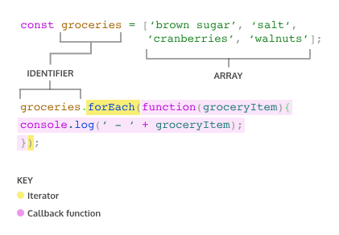

Iterators
Introduction to Iterators
Imagine we have a grocery list and want to know what each item on the list is — we might scan through each row and read every item. This common task is similar to what we have to do when we want to iterate over, or loop through, an array. One tool at our disposal is the for loop. However, we also have access to built-in array 
methods
Preview: Docs Loading link description
 that provide specialized iteration functionality.

The built-in JavaScript array methods that help us iterate are called iteration methods, at times referred to as 
iterators
Preview: Docs Loading link description
. Iterators are methods called on 
arrays
Preview: Docs Loading link description
 to manipulate elements and return values.

In this lesson, we will learn the syntax for these iterator methods, their return values, and how to use the documentation to understand them. We’ll also explore how to choose the right iterator method for a given task.

------------------------------------------------------------------------------------------------

Iterators
The .forEach() Method
The first iteration method that we’re going to learn is 
.forEach(). Aptly named, .forEach() will execute the same code for each element of an array.

Diagram outlining the parts of an array iterator, including the array identifier, the section that is the iterator, and the callback function
The preceding code example will log a nicely formatted list of the groceries to the console. Let’s explore the syntax of invoking .forEach().

groceries.forEach() calls the forEach method on the groceries array.
.forEach() takes a callback function as an argument. Remember, a callback function is a function passed as an argument to another function.
.forEach() 
loops
Preview: Docs Loading link description
 through the array and executes the callback function for each element. During each execution, the current element is passed as the argument for the callback function.
The return value for .forEach() will always be undefined.
Another way to pass a callback for .forEach() is to use arrow function syntax.

groceries.forEach(groceryItem => console.log(groceryItem));

Copy to Clipboard

We can also define a function beforehand to be used as the callback function.

function printGrocery(element){
  console.log(element);
}

groceries.forEach(printGrocery);

Copy to Clipboard

The preceding example uses a function declaration, but we can also use a function expression or arrow function.

All three code snippets do the same thing. In each array iteration method, we can use any of the three examples to supply a callback function as an argument to the iterator. It’s good to be aware of the different ways to pass in callback 
functions
Preview: Docs Loading link description
 as arguments in 
iterators
Preview: Docs Loading link description
 because developers have different stylistic preferences. Nonetheless, due to the strong adoption of ES6, we will be using arrow function syntax in the later exercises.

 bsp

const fruits = ['mango', 'papaya', 'pineapple', 'apple'];

fruits.forEach(fruit => {
  console.log(`I want to eat a ${fruit}`);
});

/*
Ausgabe:
I want to eat a mango
I want to eat a papaya
I want to eat a pineapple
I want to eat a apple
*/

 ------------------------------------------------------------------------------------

 Iterators
The .map() Method
The second iterator we’re going to cover is .map(). When 
.map()
Preview: Docs Loading link description
 is called on an array, it takes an argument of a callback function and returns a new array! Take a look at an example of calling .map():

const numbers = [1, 2, 3, 4, 5]; 

const bigNumbers = numbers.map(number => {
  return number * 10;
});

Copy to Clipboard

.map() works in a similar manner to 
.forEach()
Preview: Docs Loading link description
— the major difference is that .map() returns a new array.

In the example above:

numbers is an array of numbers.
bigNumbers will store the return value of calling .map() on numbers.
numbers.map will iterate through each element in the numbers array and pass the element into the callback function.
return number * 10 is the code we wish to execute upon each element in the array. This will save each value from the numbers array, multiplied by 10, to a new array.
If we take a look at numbers and bigNumbers:

console.log(numbers); // Output: [1, 2, 3, 4, 5]
console.log(bigNumbers); // Output: [10, 20, 30, 40, 50]

Copy to Clipboard

Notice that the elements in numbers were not altered and bigNumbers is a new array.

bps

const animals = ['Hen', 'elephant', 'llama', 'leopard', 'ostrich', 'Whale', 'octopus', 'rabbit', 'lion', 'dog'];

// Create the secretMessage array below
const secretMessage = animals.map(animal => animal[0]);

console.log(secretMessage.join(''));

const bigNumbers = [100, 200, 300, 400, 500];

// Create the smallNumbers array below
const smallNumbers = bigNumbers.map(number => number / 100);

console.log(smallNumbers);

/*
Ausgabe:
HelloWorld
[ 1, 2, 3, 4, 5 ]

------------------------------------------------------------------------------

Iterators
The .filter() Method
Another useful iterator method is 
.filter()
Preview: Docs Loading link description
. Like 
.map()
Preview: Docs Loading link description
, .filter() returns a new array. However, .filter() returns an array of elements after filtering out certain elements from the original array. The callback function for the .filter() method should return true or false depending on the element that is passed to it. The elements that cause the callback function to return true are added to the new array. Take a look at the following example:

const words = ['chair', 'music', 'pillow', 'brick', 'pen', 'door']; 

const shortWords = words.filter(word => {
  return word.length < 6;
});

Copy to Clipboard

words is an array that contains string elements.
const shortWords = declares a new variable that will store the returned array from invoking .filter().
The callback function is an arrow function that takes a single parameter, word. Each element in the words array will be passed to this function as an argument.
word.length < 6; is the condition in the callback function. Any word from the words array that has fewer than 6 characters will be added to the shortWords array.
Let’s also check the values of words and shortWords:

console.log(words); // Output: ['chair', 'music', 'pillow', 'brick', 'pen', 'door']; 
console.log(shortWords); // Output: ['chair', 'music', 'brick', 'pen', 'door']

Copy to Clipboard

Observe how words was not mutated, i.e. changed, and shortWords is a new array.

bsp

const randomNumbers = [375, 200, 3.14, 7, 13, 852];

// Call .filter() on randomNumbers below
const smallNumbers = randomNumbers.filter(num => num < 250);
console.log(smallNumbers);

const favoriteWords = ['nostalgia', 'hyperbole', 'fervent', 'esoteric', 'serene'];

// Call .filter() on favoriteWords below
const longFavoriteWords = favoriteWords.filter(words => words.length > 7);
console.log(longFavoriteWords);

/*
Ausgabe:
[ 200, 3.14, 7, 13 ]
[ 'nostalgia', 'hyperbole', 'esoteric']
*/

-------------------------------------------------------------------------------

Iterators
The .findIndex() Method
We sometimes want to find the location of an element in an array. That’s where the .findIndex() method comes in! Calling 
.findIndex()
Preview: Docs Loading link description
 on an array will return the index of the first element that evaluates to true in the callback function.

const jumbledNums = [123, 25, 78, 5, 9]; 

const lessThanTen = jumbledNums.findIndex(num => {
  return num < 10;
});

Copy to Clipboard

jumbledNums is an array that contains elements that are numbers.
const lessThanTen = declares a new variable that stores the returned index number from invoking .findIndex().
The callback function is an arrow function that has a single parameter, num. Each element in the jumbledNums array will be passed to this function as an argument.
num < 10; is the condition that elements are checked against. .findIndex() will return the index of the first element that evaluates to true for that condition.
Let’s take a look at what lessThanTen evaluates to:

console.log(lessThanTen); // Output: 3 

Copy to Clipboard

If we check what element has index of 3:

console.log(jumbledNums[3]); // Output: 5

Copy to Clipboard

Great, the element in index 3 is the number 5. This makes sense since 5 is the first element that is less than 10.

If there isn’t a single element in the array that satisfies the condition in the callback, then .findIndex() will return -1.

const greaterThan1000 = jumbledNums.findIndex(num => {
  return num > 1000;
});

console.log(greaterThan1000); // Output: -1

bsp

const animals = ['hippo', 'tiger', 'lion', 'seal', 'cheetah', 'monkey', 'salamander', 'elephant'];

const foundAnimal = animals.findIndex(animal => animal === 'elephant');

console.log(foundAnimal);

const startsWithS = animals.findIndex(animal => animal.startsWith('s'));

console.log(startsWithS);

/*
Ausgabe:
7
3
*/

--------------------------------------------------------------------------------------

Iterators
The .reduce() Method
Another widely used iteration method is .reduce(). The 
.reduce()
Preview: Docs Loading link description
 method returns a single value after iterating through the elements of an array, thereby reducing the array. Take a look at the following example:

const numbers = [1, 2, 4, 10];

const summedNums = numbers.reduce((accumulator, currentValue) => {
  return accumulator + currentValue
})

console.log(summedNums) // Output: 17

Copy to Clipboard

Here are the values of accumulator and currentValue as we iterate through the numbers array:

Iteration	accumulator	currentValue	return value
// In a table:
First	1	2	3
Second	3	4	7
Third	7	10	17

Now let’s go over the use of .reduce() from the example above:

numbers is an array that contains numbers.
summedNums is a variable that stores the returned value of invoking .reduce() on numbers.
numbers.reduce() calls the .reduce() method on the numbers array and takes in a callback function as an argument.
The callback function has two parameters, accumulator and currentValue. The value of accumulator starts off as the value of the first element in the array, and the currentValue starts as the second element. To see the values of accumulator and currentValue change, review the chart above.
As .reduce() iterates through the array, the return value of the callback function becomes the accumulator value for the next iteration, currentValue takes on the value of the current element in the looping process.
The .reduce() method can also take an optional second parameter to set an initial value for accumulator (remember, the first argument is the callback function!). For instance:

const numbers = [1, 2, 4, 10];

const summedNums = numbers.reduce((accumulator, currentValue) => {
  return accumulator + currentValue
}, 100)  // <- Second argument for .reduce()

console.log(summedNums); // Output: 117

Copy to Clipboard

Here’s an updated chart that accounts for the second argument of 100:

Iteration #	accumulator	currentValue	return value
// In a Table:
First	100	1	101
Second	101	2	103
Third	103	4	107
Fourth	107	10	117

bsp

const newNumbers = [1, 3, 5, 7];

const newSum = newNumbers.reduce((accumulator, currentValue) => {
  console.log('The value of accumulator: ', accumulator);
  console.log('The value of currentValue: ', currentValue);
  return accumulator + currentValue;
}, 10);

console.log('The final sum is:', newSum);

console.log(newSum);

/*
Ausgabe:
The value of accumulator:  10
The value of currentValue:  1
The value of accumulator:  11
The value of currentValue:  3
The value of accumulator:  14
The value of currentValue:  5
The value of accumulator:  19
The value of currentValue:  7
The final sum is: 26
26
*/

------------------------------------------------------------------------

Iterators
Iterator Documentation
There are many additional built-in array 
methods, a complete list of which can be found at MDN’s Array iteration methods page.
https://developer.mozilla.org/en-US/docs/Web/JavaScript/Reference/Global_Objects/Array#iterative_methods

The documentation for each method contains several sections:

a short definition
a block with the correct syntax for using the method
a list of parameters the method accepts or requires
the return value of the function
an extended description
examples of the method’s use
other additional information
While working through the instructions that follow, note that the code contains some 
errors
Preview: Docs Loading link description
. Use the documentation for a given method to determine the error or fill in a blank to make the code run correctly.

bsp

const words = ['unique', 'uncanny', 'pique', 'oxymoron', 'guise'];

console.log(words.some((word) => {
  return word.length < 6;
}));

const interestingWords = words.filter((word) => {
  return word.length > 5;
});

console.log(interestingWords.every(word => word.length > 5));

/*
Ausgabe:
true
true
*/

---------------------------------------------------------------------------

Iterators
Choose the Right Iterator
There are many iteration 
methods
Preview: Docs Loading link description
 to choose from. In addition to learning the correct syntax for using iteration methods, it is also important to learn how to choose the correct method for different scenarios. The checkpoints that follow provide an opportunity to do just that!

As you work through this exercise, 
errors
Preview: Docs Loading link description
 will pop up in the terminal, but they should all be gone by the end!

 bsp

 const cities = ['Orlando', 'Dubai', 'Edinburgh', 'Chennai', 'Accra', 'Denver', 'Eskisehir', 'Medellin', 'Yokohama'];

const nums = [1, 50, 75, 200, 350, 525, 1000];

//  Choose a method that will return undefined
cities.forEach(city => console.log('Have you visited ' + city + '?'));

// Choose a method that will return a new array
const longCities = cities.filter(city => city.length > 7);

// Choose a method that will return a single value
const word = cities.reduce((acc, currVal) => {
  return acc + currVal[0]
}, "C");

console.log(word)

// Choose a method that will return a new array
const smallerNums = nums.map(num => num - 5);

// Choose a method that will return a boolean value
nums.some(num => num < 0);

/*
Ausgabe:
Have you visited Orlando?
Have you visited Dubai?
Have you visited Edinburgh?
Have you visited Chennai?
Have you visited Accra?
Have you visited Denver?
Have you visited Eskisehir?
Have you visited Medellin?
Have you visited Yokohama?
CODECADEMY
*/

------------------------------------------------------------------------

Iterators
Review
Awesome job on clearing the 
iterators
Preview: Docs Loading link description
 lesson! You have learned a number of useful 
methods
Preview: Docs Methods are object properties that contain functions.
 in this lesson, as well as how to use the JavaScript documentation from the Mozilla Developer Network to discover and understand additional methods. Let’s review!

.forEach()
Preview: Docs Loading link description
 is used to execute the same code on every element in an array, but does not change the array and returns undefined.
.map()
Preview: Docs Loading link description
 executes the same code on every element in an array and returns a new array with the updated elements.
.filter()
Preview: Docs Loading link description
 checks every element in an array to see if it meets certain criteria and returns a new array with the elements that return truthy for the criteria.
.findIndex()
Preview: Docs Loading link description
 returns the index of the first element of an array that satisfies a condition in the callback function. It returns -1 if none of the elements in the array satisfy the condition.
.reduce()
Preview: Docs Loading link description
 iterates through an array and takes the values of the elements and returns a single value.
All iterator methods take a callback function, which can be a pre-defined function, a function expression, or an arrow function.
You can visit the Mozilla Developer Network to learn more about iterator methods (and all other parts of JavaScript!).

--------------------------------------------------------------------------------------

